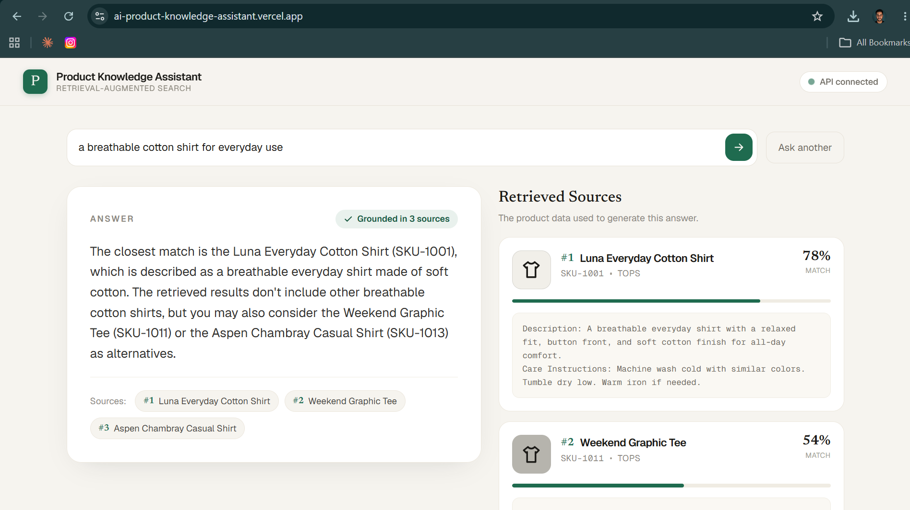
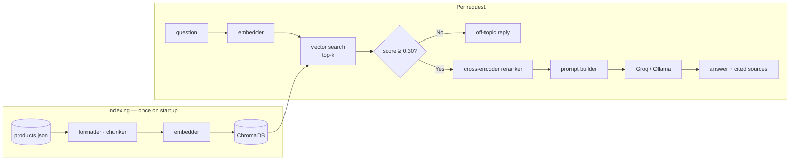
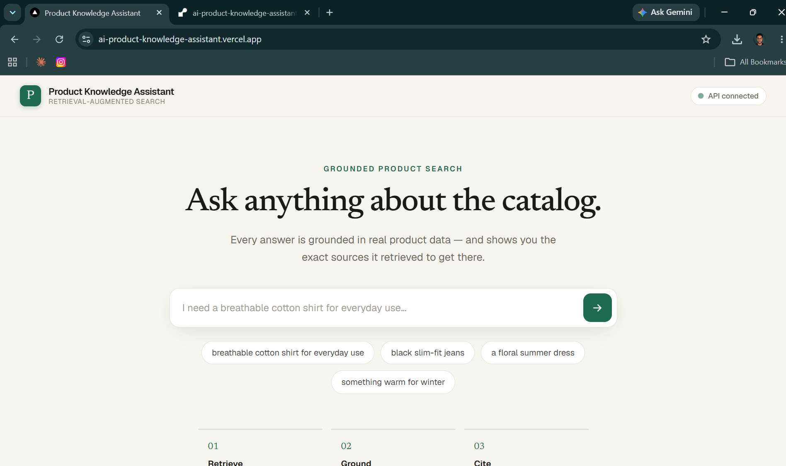
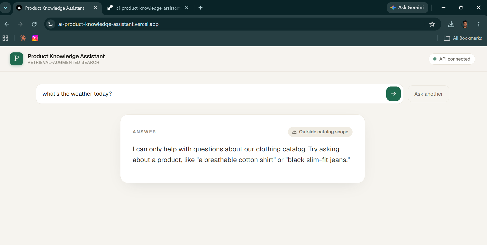

# AI Product Knowledge Assistant

[](https://github.com/mercydeez/ai-product-knowledge-assistant/actions/workflows/ci.yml)


**Live demo:** [ai-product-knowledge-assistant.vercel.app](https://ai-product-knowledge-assistant.vercel.app) (backend: [ai-product-knowledge-assistant-api.onrender.com](https://ai-product-knowledge-assistant-api.onrender.com) — free tier, may take ~30-60s to wake up if idle).



Natural-language product Q&A for e-commerce catalogs — the kind of support-reducing, discovery-improving feature that large retailers (Noon, Namshi, Amazon.ae) deploy to handle catalog questions at scale. A shopper asks a question in plain language and gets back a grounded, cited answer drawn directly from the product data; the retrieval is visible, not black-box. Built without LangChain to expose the pipeline mechanics: sentence-transformers + ChromaDB vector search + Groq, behind a FastAPI backend with a Next.js frontend.

Demonstrates the full production pattern — eval-driven development, a deterministic off-topic guardrail, streaming UX, per-IP rate limiting, and a Dockerized deployment — rather than a notebook prototype. See `design.md` for the full architecture, phased build history, and frozen API contract.

## What's implemented

- Local embeddings (sentence-transformers) + a persistent ChromaDB vector store, with optional cross-encoder reranking over a larger candidate pool (on by default locally; off in production — see `RERANK_ENABLED` in `CLAUDE.md`)
- Grounded answer generation via Groq (hosted) or Ollama (local), behind a pluggable provider
- A deterministic off-topic guardrail that declines out-of-catalog questions without ever calling the LLM
- `POST /ask` and an SSE `POST /ask/stream` for incremental token delivery, both per-IP rate-limited
- A FastAPI backend (CORS, request-timing middleware, structured logging) and a Next.js frontend showing the answer alongside its ranked sources
- Retrieval and LLM-judge answer-quality eval scripts, a unit test suite, and GitHub Actions CI
- Dockerized backend deployed to Render; frontend deployed to Vercel — see **Live demo** above and **Deployment** below

What it deliberately doesn't do: no database, no authentication, no multi-turn conversation history (single-shot Q&A).

## Architecture



## Quality Metrics

Measured against 24 hand-built question–answer pairs covering the full product catalog:

| Metric | Score |
|---|---|
| Hit-rate@3 (retrieval) | **100%** (24/24) |
| MRR (retrieval) | **0.979** |
| Avg faithfulness (LLM-judge, 1–5) | **5.00** |
| Avg relevance (LLM-judge, 1–5) | **4.96** |

Retrieval eval (`scripts/evaluate_rag.py`) runs in CI with no API key needed. LLM-judge eval (`scripts/evaluate_answers.py`) uses Groq to grade each answer 1–5 on faithfulness and relevance — run locally after changing the catalog, chunk settings, or prompt.

## Screenshots

| Ask anything | Off-topic guardrail |
|---|---|
|  |  |

The guardrail on the right declines questions outside the catalog **before the LLM is ever called** — a deterministic relevance check on retrieval scores, not the model being asked to behave.

## Project Structure

```text
ai-product-knowledge-assistant/
├── data/
│   ├── product_chunks.json
│   ├── product_embeddings.json
│   └── products.json
├── src/
│   ├── api/           # FastAPI app, routes, schemas, rate limiting
│   ├── config.py      # all tunables, loaded from .env
│   ├── embeddings/    # sentence-transformers wrapper
│   ├── llm/           # Groq/Ollama clients, provider dispatch, prompt builder
│   ├── preprocessing/ # product → text → chunks
│   ├── retrieval/     # ChromaDB indexer/search + cross-encoder reranker
│   ├── services/      # ProductRAGService, the orchestration core
│   ├── utils/
│   └── main.py        # CLI smoke test
├── scripts/           # evaluate_rag.py (retrieval), evaluate_answers.py (LLM-judge)
├── tests/
├── frontend/          # Next.js app (App Router, TypeScript, Tailwind)
│   ├── app/
│   ├── components/
│   └── lib/
├── docs/              # screenshots used in this README
├── .github/workflows/ci.yml
├── Dockerfile
├── render.yaml
├── design.md          # architecture, phased build history, API contract
├── .env.example
├── requirements.txt
└── README.md
```

## API Run

Start the API server:

```bash
uvicorn src.api.app:app --reload
```

Test the endpoint in PowerShell:

```powershell
$body = @{ question = "I need a breathable cotton shirt for everyday use." } | ConvertTo-Json
Invoke-RestMethod -Uri "http://127.0.0.1:8000/ask" -Method Post -ContentType "application/json" -Body $body
```

## Frontend

A Next.js (App Router, TypeScript, Tailwind) UI lives in `frontend/`. It calls the FastAPI `/ask` endpoint and renders the grounded answer alongside the retrieved source chunks.

```bash
cd frontend
npm install
cp .env.local.example .env.local
npm run dev
```

Open `http://localhost:3000`. The backend must be running (see above) and `CORS_ORIGINS` in `.env` must include `http://localhost:3000` (it does by default).

## Deployment

The backend is a Dockerized FastAPI app deployed to [Render](https://render.com) (free tier); the frontend is deployed to [Vercel](https://vercel.com). Both build from this repo's `main` branch.

### Backend → Render

1. In the Render dashboard: **New → Blueprint**, connect this GitHub repo, branch `main`. Render reads `render.yaml` at the repo root automatically.
2. When prompted for `GROQ_API_KEY`, paste your real key directly into Render's dashboard — it's stored as an encrypted secret and never goes through source control.
3. Click **Apply**. The first build takes a few minutes: it installs the CPU-only `torch` wheel (Render's free tier has no GPU) and bakes the `all-MiniLM-L6-v2` embedding model into the image so cold starts don't need to call out to Hugging Face.
4. Once live, copy the public URL (e.g. `https://ai-product-knowledge-assistant-api.onrender.com`) and sanity-check it: `curl https://<your-render-url>/health`.

Free tier note: the service spins down after 15 minutes idle, so the first request after a quiet period takes ~30-60s to wake back up — that's expected, not a bug.

### Frontend → Vercel

1. In the Vercel dashboard: **Add New → Project**, import this GitHub repo.
2. Set **Root Directory** to `frontend` — Next.js is auto-detected.
3. Add an environment variable: `NEXT_PUBLIC_API_BASE_URL` = the Render URL from above, **with no trailing slash** (a trailing slash turns every request into a double-slash path like `//ask`, which 404s and shows up as "API unreachable" in the UI).
4. Deploy, then copy the resulting URL (e.g. `https://ai-product-knowledge-assistant.vercel.app`). If you edit this env var later, you must trigger a new deployment — `NEXT_PUBLIC_*` vars are inlined at build time, so editing the value alone doesn't affect an already-built deployment.

### Close the loop (CORS)

5. Back in Render, edit the backend service's `CORS_ORIGINS` env var to include the Vercel URL, e.g. `https://ai-product-knowledge-assistant.vercel.app,http://localhost:3000`. Saving triggers an automatic redeploy. (Editing it directly in the dashboard's Environment tab is the reliable way to do this — a `git push` updating the same value in `render.yaml` did not auto-trigger a Blueprint sync for us.)
6. Open the Vercel URL and ask a question to confirm the full stack works live.

### Running the full stack locally with Docker Compose

```bash
docker compose up --build
```

Opens the frontend at `http://localhost:3000` and the backend at `http://localhost:8000`. `GROQ_API_KEY` is read from `.env` automatically. The ChromaDB collection is stored in a named volume (`chroma_data`) so it survives container restarts.

### Running the backend container only

```bash
docker build -t product-knowledge-assistant .
docker run -p 8000:8000 -e GROQ_API_KEY=your-key-here product-knowledge-assistant
```

## Setup Instructions

### 1. Clone the repository

```bash
git clone <your-repo-url>
cd ai-product-knowledge-assistant
```

### 2. Create virtual environment

```bash
py -3.11 -m venv .venv
```

Activate it:

Windows:

```powershell
.venv\Scripts\Activate.ps1
```

Mac/Linux:

```bash
source .venv/bin/activate
```

### 3. Install dependencies

```bash
pip install -r requirements.txt
```

### 4. Set environment variables

Copy `.env.example` to `.env`:

Windows PowerShell:

```powershell
Copy-Item .env.example .env
```

Mac/Linux:

```bash
cp .env.example .env
```

Then update the values if needed:

```env
EMBEDDING_MODEL=all-MiniLM-L6-v2
LLM_PROVIDER=groq
GROQ_API_KEY=your-key-here
GROQ_MODEL=llama-3.3-70b-versatile
```

Note: the first run will download the embedding model from Hugging Face. Internet access is needed once, then it is cached locally.

For the final answer-generation step, the default provider is **Groq** (hosted, free tier) — get a key at https://console.groq.com/keys and set `GROQ_API_KEY` in `.env`. To use a local model instead, set `LLM_PROVIDER=ollama` and start Ollama locally with a pulled model such as `llama3.2:3b`.

### 5. Run the project

```bash
python src/main.py
```

Expected output:

```text
Loaded 24 products

First product:
Luna Everyday Cotton Shirt
```

### 6. Run tests

```bash
python -m unittest discover -s tests
```

### 7. Lint

```bash
pip install -r requirements-dev.txt   # installs ruff
ruff check .
```

### 8. Evaluate retrieval quality

A small retrieval-only eval (no LLM call, no `GROQ_API_KEY` needed) reports hit-rate@k and MRR over a hand-built question set in `scripts/evaluate_rag.py`:

```bash
python scripts/evaluate_rag.py
```

Exits non-zero if hit-rate drops below `--min-hit-rate` (default `0.8`) — useful as a regression check after changing the embedding model, chunking, or product data.

A GitHub Actions workflow (`.github/workflows/ci.yml`) runs backend lint + tests and frontend lint + build on every push/PR to `main`.

### 9. Evaluate answer quality

An LLM-judge eval (real Groq calls — needs `GROQ_API_KEY`, not run in CI) generates a real answer for each question in the same set, then asks Groq to grade it 1-5 on faithfulness (no invented facts) and relevance:

```bash
python scripts/evaluate_answers.py
```

Exits non-zero if either average drops below `--min-score` (default `4.0`) — a regression check for prompt/grounding changes that `evaluate_rag.py`'s retrieval-only metrics can't catch.

## Updating the Product Catalog

Edit `data/products.json`, then delete the three generated artifacts so the pipeline rebuilds them on the next startup:

```bash
# Linux / macOS
rm data/product_chunks.json data/product_embeddings.json
rm -rf data/chroma_db/

# Windows PowerShell
Remove-Item data/product_chunks.json, data/product_embeddings.json
Remove-Item -Recurse -Force data/chroma_db/
```

Restart the server (`uvicorn src.api.app:app --reload`) and the pipeline regenerates chunks, re-embeds them, and re-seeds the ChromaDB collection automatically — no code changes needed. The same applies after changing `CHUNK_SIZE`, `CHUNK_OVERLAP`, or `EMBEDDING_MODEL` in `.env`.

After a catalog change, re-run the retrieval eval to confirm quality hasn't regressed:

```bash
python scripts/evaluate_rag.py
```

## Why This Structure

- **Modular architecture** — `src/` separates the API layer, RAG orchestration, retrieval, LLM clients, and preprocessing into independent packages, demonstrating clean separation of concerns rather than one monolithic script.
- **Centralized, environment-driven config** (`config.py`) — every tunable (embedding model, chunk size, rerank settings, rate limits) flows through one place and is overridable via `.env`, the same pattern used in production services.
- **Tested at the unit and integration level** (`tests/`) — the RAG-specific logic (chunking, document formatting, prompt construction, retrieval ranking, the off-topic guardrail) has dedicated tests, not just smoke tests, with GitHub Actions CI enforcing it on every push.
- **Evaluation, not just demos** (`scripts/`) — retrieval quality (hit-rate/MRR) and answer quality (LLM-judge faithfulness/relevance) are measured against a fixed question set, the same discipline used to validate real RAG systems before shipping.

## Engineering Decisions & Tradeoffs

**Reranking is on locally, off in production — and that's intentional.**
The cross-encoder reranker (`cross-encoder/ms-marco-MiniLM-L-6-v2`) improves result ordering by running a heavier model over a larger candidate pool. Locally it's fast enough to be worth it. On Render's free-tier CPU it added ~9–10s to every `/ask` call. The tell was that off-topic queries — which skip the Groq call entirely — took just as long as in-catalog ones, isolating the rerank pipeline as the bottleneck, not the LLM. Rather than degrade the live demo, `render.yaml` sets `RERANK_ENABLED=false` while local dev keeps it on by default. The off-topic relevance gate is deliberately decoupled from reranking (it reads the pre-rerank cosine score), so disabling reranking in production doesn't change the threshold calibration.

**The off-topic threshold (0.30) was calibrated empirically, not guessed.**
A round number like 0.5 would silently reject legitimate queries. Running the full question set against the vector store showed that clearly off-topic queries (jokes, general knowledge, store policy) top out around 0.26, while the lowest-scoring genuine in-catalog queries (e.g. "show me your tops") floor around 0.33–0.35. The 0.30 threshold sits in that gap. It's narrow — about 0.04–0.07 of headroom on each side — which is why `MIN_RELEVANCE_SCORE` is an env var and the CLAUDE.md warns against assuming a round number is safe without re-measuring.

**`@app.middleware("http")` silently broke SSE streaming.**
Starlette's `BaseHTTPMiddleware` (the decorator form) fully buffers the response body before forwarding it — which is fine for `/ask` (body already complete) but causes real-time streaming on `/ask/stream` to deliver all tokens at once at the end. The fix was replacing the decorator middleware with a plain ASGI class (`RequestTimingMiddleware`) that wraps the `send` callable directly, so chunks pass through immediately. This is a documented Starlette limitation but easy to miss, and it would be invisible in local testing where latency is near zero.
